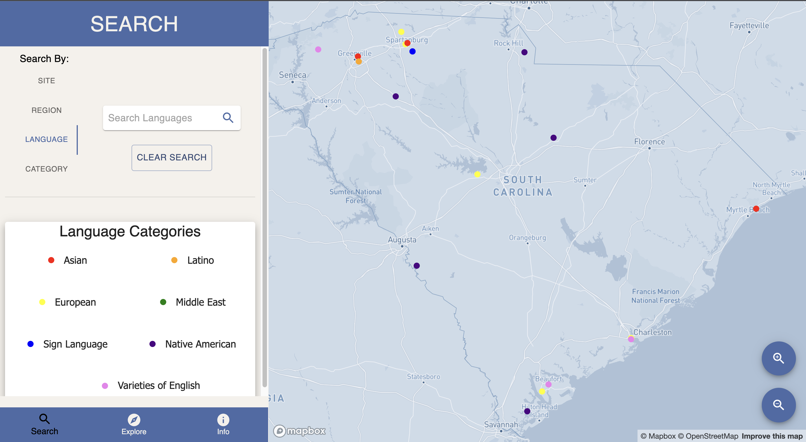
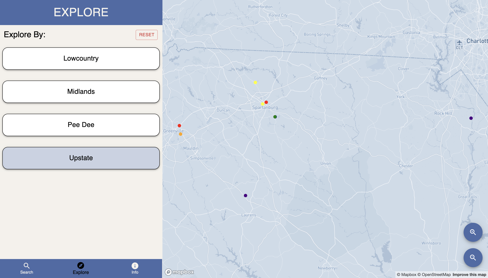
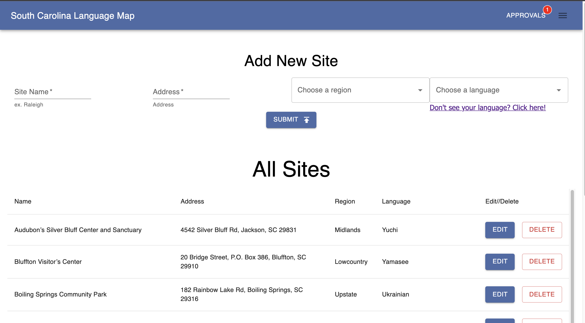
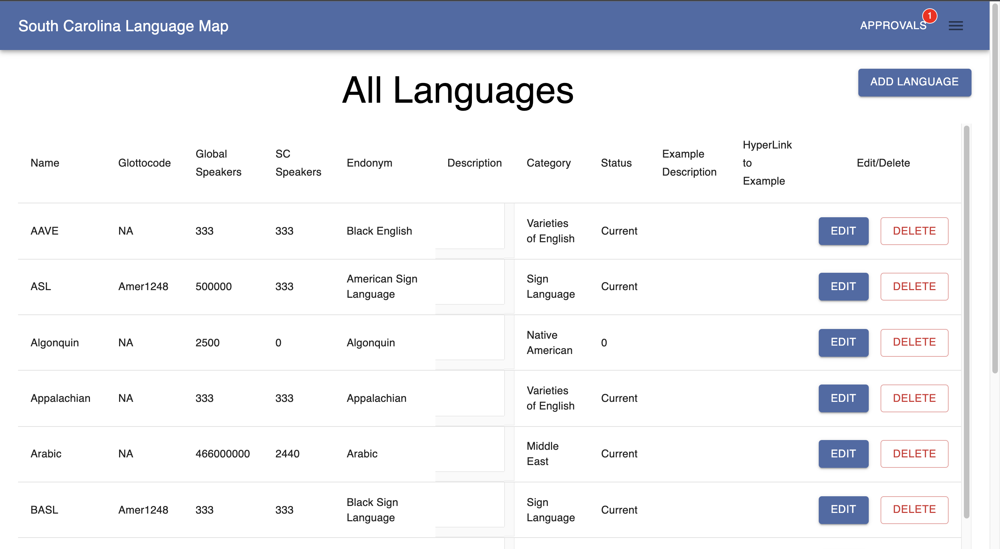
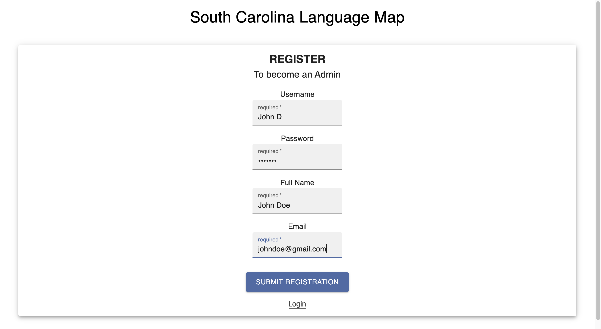

# South Carolina Language Map

## Description:

A Full Stack web application for collecting and displaying sites in South Carolina where specific languages are spoken, and providing access to that data by both researchers and casual users. Sites are displayed on a map, are searchable, and display the details of the language spoken there.

Administrators have access to table views of the Sites, Languages, and Language Categories, with the ability to add, remove, and edit them. Administrators also have the ability to add other administrators.

A live version of the site is available at [languagemapsc.herokuapp.com](https://languagemapsc.herokuapp.com).

## Screen Shots
| | |
| -------------- | ----------- | 
|  |  |
||  |

## Prerequisites

- [Node.js](https://nodejs.org/en/)
- [PostgreSQL](https://www.postgresql.org/)

## Development Setup Instructions

- Fork and Clone
- Create a new database called `sc_language_map`
- Run the code in database.sql to initialize the tables and import data
  - If you would like to name your database something else, you will need to change `sc_language_map` to the name of your new database name in `server/modules/pool.js`
- Babel needs extra configuration to avoid attempting to transpile Mapbox. To make sure the map canvas renders appropriately, follow these instructions:
  - Paste the following into package.json:
    ```
    "browserslist": {
      "production": [
        ">0.2% and supports es6-class",
        "not dead",
        "not op_mini all",
        "not chrome < 51",
        "not safari < 10"
      ],
      "development": [
        "last 1 chrome version",
        "last 1 firefox version",
        "last 1 safari version"
      ]
    }
    ```
  - run `npx browserslist@latest --update-db` to ensure your system reads the changes
- Run `npm install`
- Create a `.env` file at the root of the project and paste this line into the file:
  ```
  SERVER_SESSION_SECRET=superDuperSecret
  REACT_APP_MAPBOX_ACCESS_TOKEN=mapboxAcessToken
  ```
   - Replace `superDuperSecret` with some long random string like `25POUbVtx6RKVNWszd9ERB9Bb6`. The secret must be longer than 8 characters and not 'superDuperSecret' in order to avoid warnings.
   - In addition, you will need to replace `mapboxAccessToken` with your own token from [https://mapbox.com](https://mapbox.com)
- Start postgres if not running already by using `brew services start postgresql`
- Run `npm run server`
- Run `npm run client`
- Navigate to `localhost:3000`

## Usage

User:
1. Navigate the map view by clicking and dragging, scrolling with the mouse or trackpad, or clicking the zoom buttons in the lower right.
2. Navigate between the Search, Explore, and Info panels by clicking the navbar in the lower-left.
3. On the search panel: Select a criteria to search by, input your search query in the text box, and press enter or click the search icon to filter the sites shown on the map. Search will match all or parts of words, case insensitive. 'Clear Search' resets the map to show all locations.
4. On the explore panel: Select one of the listed criteria to show options to filter by. Clicking one of these displayed options will filter the displayed locations to show only those that fit the criteria. Clicking the 'Reset' button will restart this process from the beginning.
5. Admins can access the admin login page via the 'Click Here' link on the info tab, or by appending '#/admin' directly to the url.

Admin:
1. At the login screen, click 'register' to set up a new admin.
2. Complete the form and click submit to add a pending admin approval to the database. For development purposes, you will need to modify the first admin directly in the postgreSQL database to have `clearance_level: 1`. After that, a logged in admin can approve other pending administrators.
3. After setting the clearance level or being approved by an admin, access the main admin views by logging in.
4. On the default Sites view, add a new site to the database by filling the form at the top of the page and clicking submit; and view, edit, and delete existing entries via the controls in the table.
5. Visit the languages page to add, edit, or delete languages from the database. This page can be accessed via the hamburger icon in the upper right.
6. Visit the categories page, also accessible through the navigation menu, to add, edit, or delete categories from the database.
7. A red number above the 'Approvals' link in the navbar signals that there are pending admin requests. Click 'Approvals to view a list of pending requests, and approve or decline them.
8. Logout via the navigation menu.

## Built With

- Node.js
- Express.js
- PostgreSQL
- Mapbox API
- react-map-gl
- React
- React-Redux
- Redux-Saga
- Passport.js
- Axios
- Material UI

## Acknowledgements

Special thanks to Stephen Davis, who pitched this project and entrusted it to us. Additional thanks to the staff at Prime Academy as well as our peers in the Solinas Cohort for their help and support. 

## Support

Questions can be directed to southcarolinalanguagemap@gmail.com.